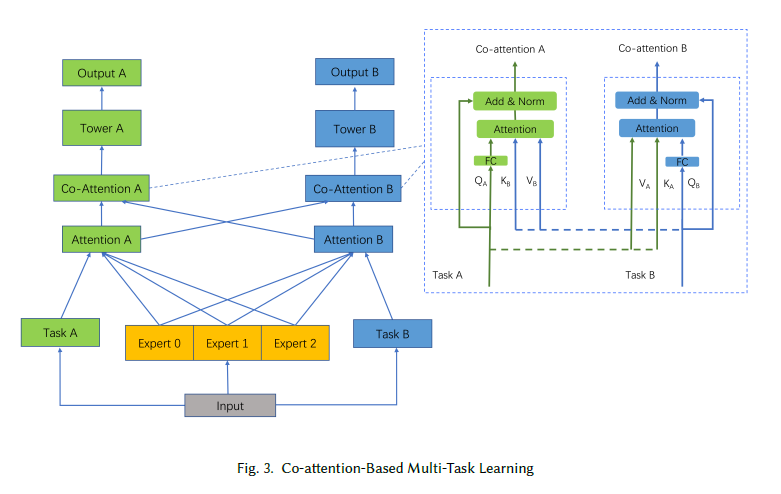
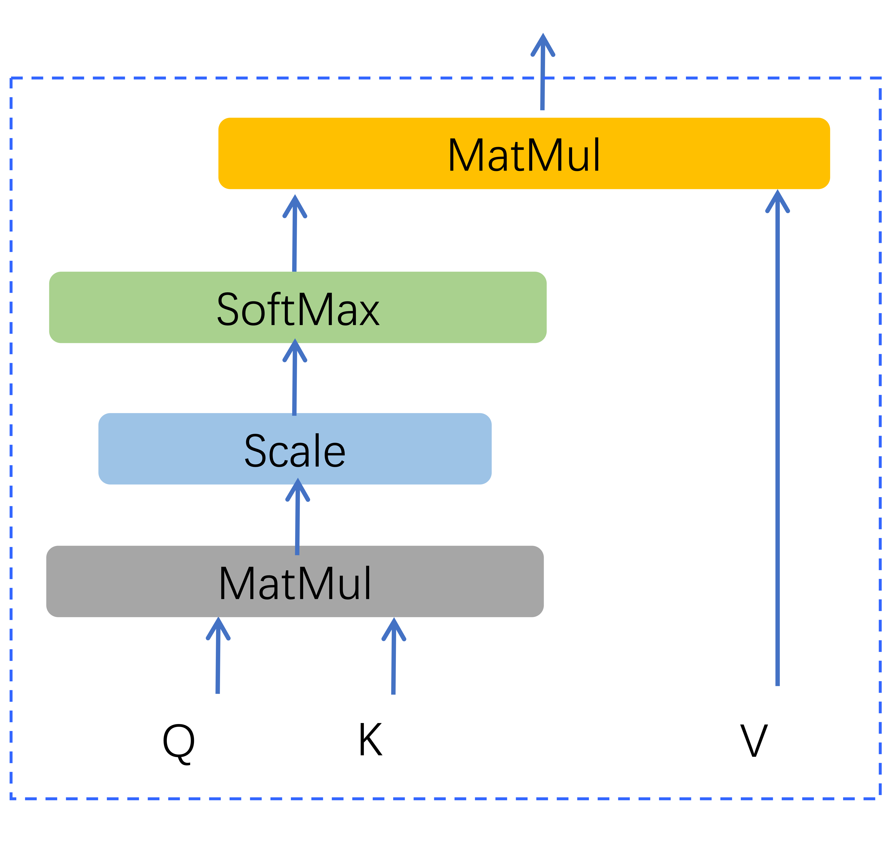
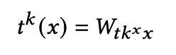
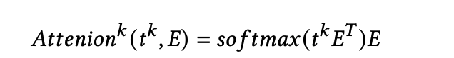
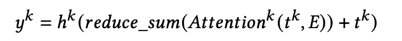
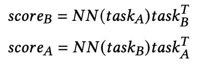
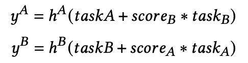
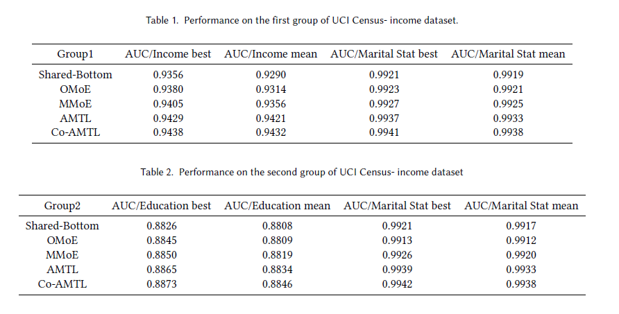

## Co-AMTL
### 介绍  
本文提出了一种基于注意力机制的多任务关联关系学习模型(AMTL)。从原始输入特征信息中学习到task的表达，借用Attention机制实现task与experts间的关联，实现对特征的聚焦，对不同任务之间进一步通过co-Attention的方式实现上层表达的共享，捕捉任务间的关联。模型如图所示：

--<div align=center></div>  

实验证明本文提出的这种基于Attention机制的多任务关联学习模型，对比MMOE的多门控方式能更准确的区分出特征子集中相关与不相关的特征，将模型注意力集中在确实有影响的那些特征上，对于特征子集的专注聚焦更精准，同时对于多任务之间的分享粒度把控的更好。

### attention门控



Gating networks的生成是基于原始特征输入进行学习的，其直接根据输入特征对各个任务的专家网络权重进行了分配，但是并没有和专家网络形成直接的关联。不同任务对于专家网络的注意力分布，应当基于专家网络本身和任务本身会更直接有效。因此借鉴attention机制替换gate门控单元使得权重分配同时与专家网络和任务表征形成关联，从而让各个任务获取到更为关联的特征信息。





式中E是专家网络expert的输出，作为特征提取的结果，$t^k$是第k个目标任务的表征向量，是输入特征连接各个任务独有的全连接层生成的任务表征。将两者进行任务表征与专家网络的转置进行矩阵相乘，输出的结果进行使用softmax归一化，并和专家网络相乘，得到attention计算的结果。

将attention输出结果进行求和，同时还需要任务的表征向量作为独立信息与其进行残差连接，以更好的抽取各个任务的独有特征和公有特征。



最终输出的结果将代表各个任务特征表示，输入到上层当中。

###  co-attention上层共享

专家网络和attention门控将基础特征进行抽取分割后，获得各个任务的高层特征表达。为了能够利用高层特征进行模型预测，和更进一步的使得任务之间产生信息互助，促进多个任务效果。

采用不对称的co-attention机制进行任务特征之间有可选择性的共享辅助。



将任务表征输入到全联接层当中并与另一个任务表征进行点乘计算，得到任务交互的信息关联分数score



将任务的表征和另一个任务的表征与关联score相乘的结果进行求和，并连接一个全连接层映射到1维向量，并通过sigmod函数将将输出映射到0--1，作为预测结果。

### 模型训练

开源数据集：**The UCI census-income dataset**

网址：[https://archive.ics.uci.edu/ml/datasets/Census-Income+%28KDD%29](https://archive.ics.uci.edu/ml/datasets/Census-Income+(KDD))

census-income.data：199523 条训练数据 

census-income.test：99762条测试数据，

包含40个特征，本数据集主要用于分类任务，设计了两组实验组预测的目标

（1）

* Task 1: Predict whether the income exceeds $50K;

* Task 2: Predict whether this person’s marital status is never married.

（2）  

* Task 1: Predict whether the education level is at least college;

* Task 2: Predict whether this person’s marital status is never married.

样本示例：

样本样例：

38, Private, 6, 36, 1st 2nd 3rd or 4th grade, 0, Not in universe, Married-civilian spouse present, Manufacturing-durable goods, Machine operators assmblrs & inspctrs, White, Mexican (Mexicano), Female, Not in universe, Not in universe, Full-time schedules, 0, 0, 0, Joint one under 65 & one 65+, Not in universe, Not in universe, Spouse of householder, Spouse of householder, 1032.38, ?, ?, ?, Not in universe under 1 year old, ?, 4, Not in universe, Mexico, Mexico, Mexico, Foreign born- Not a citizen of U S , 0, Not in universe, 2, 12, 95, - 50000.

经过hash编码和特征转化为整理为：

0 0 1005,3578,3164,208,2272,3568,3917,3967,2332,350,1987,3943,2559,511,3921,57,3995,1450,2226,307,2539,3539,476,3464,3447,3400,3824,3945,2389,632,3865,1669,2221,256,3240,733,3099,2888,3937

存放位置：./model/data/

输出的预测和输入的label通过logloss进行损失计算，并将多个任务的loss求和作为目标函数进行训练。

### 模型效果对比  

与Shared-Bottom、OMoE、MMoE等经典多任务模型对比

<div align=center></div>  

### 运行方式

```shell
cd model/
sh run_test.sh
```

参数配置：config.py